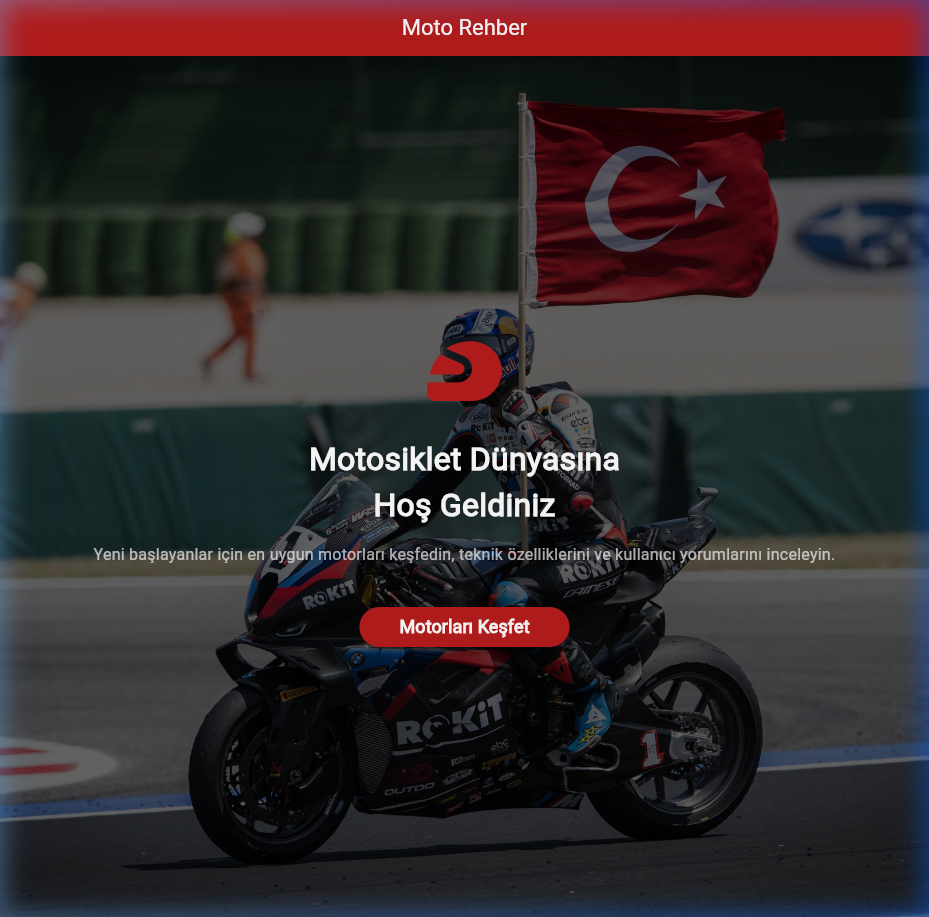
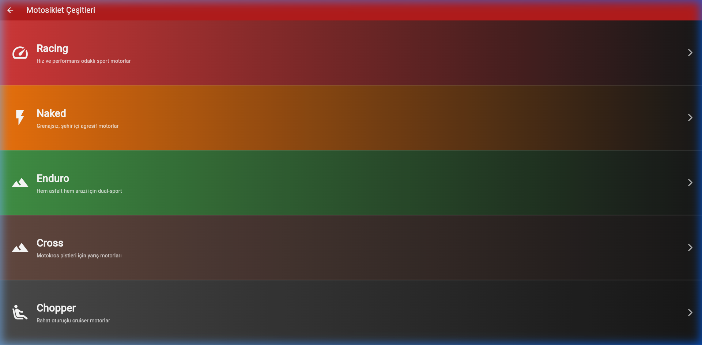
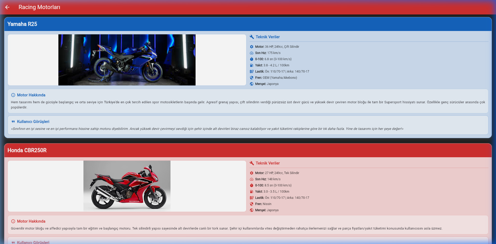

# PROJE RAPORU

## 1. KAPAK SAYFASI

**Öğrenci Bilgileri:**
- **Ad Soyad:** Furkan Kul
- **Öğrenci Numarası:** 243302021
- **Bölüm:** Bilişim 

**Proje Bilgileri:**
- **Proje Adı:** Motosiklet Rehberi (Moto Rehber)
- **Proje Konusu:** Yeni başlayan motosiklet sürücüleri için kategorize edilmiş, teknik detayları ve kullanıcı yorumlarını içeren interaktif bir keşif uygulaması.

**Github Linki:**
- [GITHUB REPO LİNKİNİZİ BURAYA YAPIŞTIRIN]

---

## 2. PROJE AMACI VE FİKRİ

**Uygulamanın Amacı:**
Bu uygulama, motosiklet dünyasına yeni adım atmak isteyen kişilerin, kendilerine en uygun motor tarzını (Racing, Naked, Enduro vb.) keşfetmelerini ve seçtikleri modeller hakkında detaylı teknik verilere tek bir yerden ulaşmalarını sağlamak amacıyla geliştirilmiştir.

**Neden Bu Konuyu Seçtim?**
Motosikletlere olan kişisel ilgim ve yeni başlayanların "Hangi motorla başlamalıyım?" sorusuna cevap ararken çok fazla bilgi kirliliğiyle karşılaşması beni bu projeye yöneltti. Uygulamada sadece teknik verileri değil, "Kullanıcı Görüşleri" kısmını da ekleyerek daha samimi ve gerçekçi bir deneyim sunmak istedim. Tasarımda agresif ve enerjik renkler kullanarak motosiklet dünyasının ruhunu yansıtmaya çalıştım.

---

## 3. PROJE TEMEL KLASÖR YAPISI

Projenin dosya yapısı standart Flutter mimarisine uygun olarak düzenlenmiştir:

- **lib/**: Uygulamanın tüm kaynak kodlarının bulunduğu klasör.
  - `main.dart`: Uygulamanın giriş ve tema ayarlarının yapıldığı dosya.
  - `ekranlar.dart`: Tüm arayüz tasarımlarının ve sayfa geçiş mantığının bulunduğu dosya.
  - `modeller.dart`: Veri yapısının (Motosiklet sınıfı) ve motor listesinin tanımlandığı dosya.
- **assets/images/**: Uygulamada kullanılan motosiklet resimlerinin ve arka plan görsellerinin tutulduğu klasör.
- **pubspec.yaml**: Proje bağımlılıklarının ve asset tanımlamalarının yapıldığı dosya.

---

## 4. KOD BLOKLARI VE TEKNİK AÇIKLAMALAR

### 4.1. main.dart
Uygulamanın başlangıç noktasıdır. Burada ana tema ve renk paleti belirlenmiştir.

```dart
import 'package:flutter/material.dart';
import 'ekranlar.dart';

void main() {
  runApp(const MyApp());
}

class MyApp extends StatelessWidget {
  const MyApp({super.key});

  @override
  Widget build(BuildContext context) {
    // MaterialApp kullandım çünkü bu widget uygulamanın temel ayarlarını (tema, başlık, ana sayfa) 
    // toplu bir şekilde yönetmemi sağlıyor. Navigasyon yapısı için de bu şart.
    return MaterialApp(
      title: 'Başlangıç Motoru Rehberi',
      debugShowCheckedModeBanner: false,
      
      theme: ThemeData(
        primarySwatch: Colors.deepOrange,
        appBarTheme: const AppBarTheme(
          backgroundColor: Colors.deepOrange,
          foregroundColor: Colors.white,
        ),
        scaffoldBackgroundColor: Colors.grey[100],
      ),
      
      home: const AnaSayfa(),
    );
  }
}
```
**Teknik Açıklama:** `MaterialApp` widget'ını tercih ettim çünkü navigasyon ve tema yönetimini çok kolaylaştırıyor. `primarySwatch` kısmında `deepOrange` seçerek uygulamanın daha dinamik durmasını sağladım.

### 4.2. modeller.dart
Veri yönetimini sağlamak için oluşturulan model dosyasıdır.

```dart
class Motosiklet {
  final String isim;
  final String aciklama;
  final String resimUrl;
  // ... diğer değişkenler
  final String kategori;

  Motosiklet({
    required this.isim,
    // ... constructor
    required this.kategori,
  });
}

// Tüm motor verileri bir listede tutuluyor
List<Motosiklet> motorlar = [ ... ];
```
**Teknik Açıklama:** Verileri bir sınıf (`class`) yapısında tuttum çünkü bu sayede her motorun ismini, resmini ve özelliklerini düzenli bir şekilde yönetebiliyorum. `ListView` içerisinde bu listeyi dönmek kod kalabalığını engelliyor.

### 4.3. ekranlar.dart (Ana Sayfa ve Navigasyon)
Uygulamanın görsel kısımları ve sayfalar arası geçişler burada tanımlanmıştır.

```dart
// Navigasyon Mantığı Açıklaması
onPressed: () {
  Navigator.push(
    context,
    PageRouteBuilder(
      pageBuilder: (context, animation, secondaryAnimation) => const KategoriSayfasi(),
      transitionsBuilder: (context, animation, secondaryAnimation, child) {
        return FadeTransition(opacity: animation, child: child);
      },
    ),
  );
},
```
**Teknik Açıklama:** Sayfalar arası geçişte `Navigator.push` kullandım. Geçişin daha akıcı olması için `PageRouteBuilder` ile özel bir 'fade' efekti ekledim. `Scaffold` widget'ını kullanarak sayfanın `AppBar` ve `body` kısımlarını standart bir yapıda oluşturdum.

---

## 5. EKRAN GÖRÜNTÜLERİ

Aşağıda uygulamanın farklı bölümlerinden alınan ekran görüntüleri yer almaktadır:

### Ana Sayfa


### Kategori Listesi


### Motor Detay Kartları


